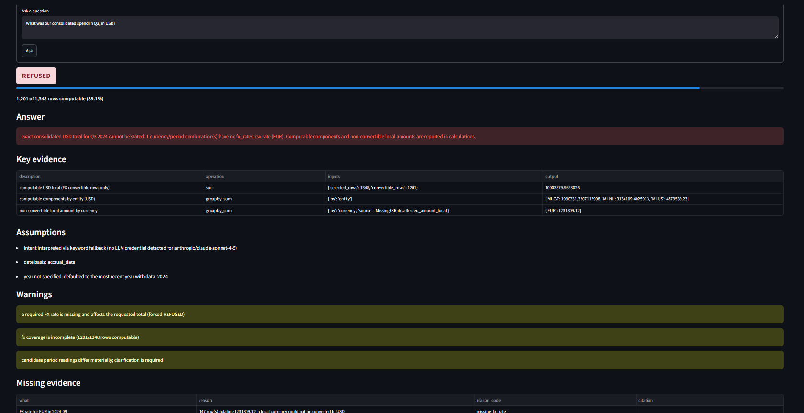

# Meridian Finance Analyst Assistant

Sistema de análisis financiero determinista para una empresa financiera de ejemplo. Una
pregunta en lenguaje natural se interpreta con un LLM, pero cada hecho — cada
suma, conversión de moneda, ranking o comparación contra un umbral — lo
establece Python puro. Un Evidence Gate determinista decide si esos hechos
alcanzan para responder (`ANSWER`), responder con reservas (`PARTIAL`),
pedir aclaración (`NEEDS_CLARIFICATION`) o rechazar (`REFUSED`) — el modelo
nunca participa en esa decisión.

340 tests pasan. Los evals pasan 16/16 — 8 deterministas más 8 de la capa
`--live`, verificada contra un proveedor real (ver `NOTES.md`). Los ocho
workflows analíticos del caso tienen un status esperado (`ANSWER` /
`PARTIAL` / `REFUSED` / `NEEDS_CLARIFICATION`) definido y verificado por
esos evals.

> Ver [`ARCHITECTURE.md`](ARCHITECTURE.md) para el diseño completo y
> [`NOTES.md`](NOTES.md) para el diario de desarrollo.

## Documentación

- [`Meridian_Documentacion_Tecnica_ESP_Juan_Tellez.pdf`](docs/Meridian_Documentacion_Tecnica_ESP_Juan_Tellez.pdf) — documento técnico y funcional: diseño, decisiones y alcance del caso.
- Presentación ([ESP](docs/Meridian_Presentacion_ESP_Juan_Tellez.pptx) / [EN](docs/Meridian_Presentation_EN_Juan_Tellez.pptx)) — deck de presentación del proyecto, en español e inglés.

## Pregunta de ejemplo con salida real

`examples/questions/q1_opex_q2_2024.json`:

```json
{"intent": "opex_by_cost_centre", "question": "What was our opex by cost centre in Q2?", "params": {"quarter": "Q2", "year": 2024}}
```

Corrida real (`python -m finance_assistant.cli examples/questions/q1_opex_q2_2024.json`):

```
status: answer
intent: opex_by_cost_centre
assumptions:
  - date basis: accrual_date
  - opex perimeter: chart_of_accounts.statement_line == 'Operating Expenses'
  - the perimeter did not exclude any row: every chart-of-accounts account belongs to the declared line
  - R4 reporting_cost_centre normalization applied before aggregation
coverage: selected_rows=1393 computable_rows=1393 computable_amount_pct=100.0
result:
  quarter: Q2
  year: 2024
  date_basis: accrual_date
  opex_perimeter:
    statement_line: Operating Expenses
  opex_perimeter_rows: 1393
  total_rows_before_perimeter_filter: 1393
  total_usd: 12780721.798092201
  by_cost_centre_usd:
    ENG-EU: 1521708.7180453
    ENG-US: 1254870.59
    MKT-US: 853906.97
    OPS-AMER: 2096018.97
    OPS-CA: 1512779.2248054
    OPS-EU: 2503945.3815794
    SGA-CA: 739198.096634
    SGA-EU: 1234406.2370281
    SGA-US: 1063887.6099999999
  unmapped_account_rows: 0
```

Notar `reporting_cost_centre normalization`: el memo del board declara una
reorganización a mitad de año (`OPS-NA -> OPS-AMER`, efectiva 2024-07-01);
la normalización se aplica solo donde corresponde y queda declarada como
assumption, nunca inferida en silencio.

## Rechazo con evidencia parcial

No todas las preguntas tienen respuesta exacta, y un rechazo no siempre
significa manos vacías. `examples/questions/q3_consolidated_q3_2024.json`:

```json
{"intent": "consolidated_spend", "question": "What was our consolidated spend in Q3, in USD?", "params": {"quarter": "Q3", "year": 2024}}
```

Corrida real (`python -m finance_assistant.cli examples/questions/q3_consolidated_q3_2024.json`):

```
status: refused
intent: consolidated_spend
refusal_reason: exact consolidated USD total for Q3 2024 cannot be stated: 1 currency/period combination(s) have no fx_rates.csv rate (EUR). Computable components and non-convertible local amounts are reported in calculations.
assumptions:
  - date basis: accrual_date
warnings:
  - a required FX rate is missing and affects the requested total (forced REFUSED)
  - fx coverage is incomplete (1201/1348 rows computable)
missing_evidence:
  - what: FX rate for EUR in 2024-09
    reason: 147 row(s) totaling 1231309.12 in local currency could not be converted to USD
    reason_code: missing_fx_rate
coverage: selected_rows=1348 computable_rows=1201 computable_amount_pct=89.09495548961425
calculations:
  - description: computable USD total (FX-convertible rows only)
    operation: sum
    inputs: {'selected_rows': 1348, 'convertible_rows': 1201}
    output: 10003879.9533026
  - description: computable components by entity (USD)
    operation: groupby_sum
    inputs: {'by': 'entity'}
    output: {'MI-CA': 1990231.3207112998, 'MI-NL': 3134109.4025913, 'MI-US': 4879539.23}
  - description: non-convertible local amount by currency
    operation: groupby_sum
    inputs: {'by': 'currency', 'source': 'MissingFXRate.affected_amount_local'}
    output: {'EUR': 1231309.12}
```

Falta la tasa EUR de 2024-09, así que el total exacto genuinamente no
existe y `result` es `null`. Pero el rechazo no es mudo: `calculations`
entrega el 89.09% del cuadro que sí es computable — total USD, desglose por
entidad, y el monto local que quedó sin convertir — con total claridad
sobre qué falta y por qué. Por qué esto es una decisión de diseño deliberada,
no un efecto colateral, se argumenta en
[`ARCHITECTURE.md`](ARCHITECTURE.md#discrepancia-argumentada).

## Prerrequisitos

- Python ≥ 3.11
- git

Este proyecto se desarrolló en Windows con PowerShell 5.1; los comandos de
esta guía se dan para PowerShell y para bash.

## Instalación

**PowerShell:**

```powershell
python -m venv .venv
.venv\Scripts\Activate.ps1
pip install -e ".[dev]"
```

**bash:**

```bash
python -m venv .venv
source .venv/bin/activate
pip install -e ".[dev]"
```

Si corrés un comando con el Python del sistema en vez del `.venv` del
proyecto, `cli.py` y `evals/run_evals.py` lo detectan y te dan el comando
exacto para arreglarlo en vez de un traceback crudo.

## Configuración

```powershell
Copy-Item .env.example .env
```

```bash
cp .env.example .env
```

`.env` define `LLM_MODEL`, la credencial del proveedor correspondiente
(`ANTHROPIC_API_KEY` / `OPENAI_API_KEY` / `GEMINI_API_KEY` / `GROQ_API_KEY`,
vía `litellm`), `LLM_MIN_CONFIDENCE`, y tres ceilings — `LLM_MAX_CALLS_PER_QUESTION`,
`LLM_MAX_TOKENS_PER_QUESTION`, `LLM_MAX_COST_USD_PER_QUESTION` — que acotan
la capa de orquestación LLM en pasos, tokens y coste. Ninguna de estas
variables es requerida: `pytest -q` y `python -m evals.run_evals` (sin
`--live`) corren completos sin `.env`; el CLI en modo JSON tampoco lo toca.
Solo el modo texto libre del CLI y `--live` en los evals leen estas
variables, y ambos degradan solo, sin fallar, cuando no hay credencial (ver
"Comportamiento sin credencial" más abajo). Si `LLM_MODEL` apunta a un
proveedor cuya key no está seteada pero hay otra credencial soportada
presente, el CLI y la UI lo distinguen explícitamente de "no hay ninguna
credencial" (`Settings.other_credentials_present`), en vez de solo señalar
la variable que falta.

## Cómo correr

**Tests:**

```powershell
pytest -q
```

340 tests, corren en ~7 segundos, sin tocar `data/` (los fixtures escriben
CSVs sintéticos en `tmp_path`) y sin requerir ninguna credencial LLM.

**Evals** (el set determinista de las 8 preguntas analíticas del caso):

```powershell
python -m evals.run_evals
```

Exit code no-cero si algo falla; el tier determinista pasa
`deterministic tier: 8/8 case(s) passed`. Acepta `--live` para además correr
las mismas 8 preguntas en texto libre contra la capa de orquestación LLM
real (`interpret_with_llm`), verificando ruteo de intent y disciplina de
evidencia (`required_sources`, `forbidden_claims`):

```powershell
python -m evals.run_evals --live
```

Sin credencial, el tier `--live` se reporta como `SKIP` razonado y nunca
afecta el exit code — falta de configuración, no falla de comportamiento.
Con credencial pasa `live tier: 8/8 case(s) passed`, para un total de 16/16
entre ambos tiers.

**CLI — modo JSON**, resuelve una pregunta estructurada contra un intent y
datos reales, sin credencial:

```powershell
python -m finance_assistant.cli examples/questions/q1_opex_q2_2024.json
```

Solo 3 de las 8 preguntas tienen JSON de ejemplo en
`examples/questions/`; ver Limitaciones conocidas.

**CLI — modo texto libre**, rutea la pregunta a través de
`orchestration.orchestrator.answer_question`: hace una única llamada LLM si
hay credencial, o cae al intérprete determinista por palabras clave si no
la hay (mismo comportamiento en ambos casos, ver más abajo):

```powershell
python -m finance_assistant.cli "What was our opex by cost centre in Q2 2024?"
```

Con `--live`, `python -m evals.run_evals --live` y este modo de texto libre
son las dos únicas vías que requieren credencial. Para correr con
credencial real:

```powershell
Copy-Item .env.example .env   # completar LLM_MODEL + la API key del proveedor
python -m finance_assistant.cli "What was our opex by cost centre in Q2 2024?" --model anthropic/claude-sonnet-4-5
```

`--model` es opcional y sobreescribe `LLM_MODEL` solo para esa corrida.

**UI** — Streamlit, capa pura sobre `answer_question` (mismo path que el
modo texto libre del CLI, sin lógica de análisis propia):

```powershell
streamlit run src/finance_assistant/ui/app.py
```

Pregunta → badge de estado → respuesta → evidencia clave → asunciones →
advertencias → fuentes → "How I got this" (timeline expandible) → trace
JSON crudo. Sin credencial, cae al mismo intérprete por palabras clave que
el CLI, declarado en pantalla, nunca en silencio.



## Comportamiento sin credencial

Sin una API key configurada, las ocho preguntas analíticas se siguen
respondiendo — esto es una propiedad del diseño, no un caso degradado.
`orchestration.orchestrator.answer_question` detecta la ausencia de
credencial (`Settings.has_credential`) y cae automáticamente a
`interpret_with_keywords`, un intérprete determinista por palabras clave;
la caída queda declarada explícitamente en `assumptions`
(`"intent interpreted via keyword fallback..."`), nunca silenciosa. El
`RunTrace` resultante tiene `model_calls: []` porque, correctamente, no se
hizo ninguna llamada.

Esto está cubierto por un test dedicado que corre las ocho preguntas sin
ninguna credencial en el entorno y verifica que ninguna resuelva a `ERROR`:

```powershell
pytest tests/test_orchestration_orchestrator.py -k test_no_credential_falls_back_to_keyword_interpreter_and_answers_all_eight_questions -v
```

## Estructura del proyecto

```
src/finance_assistant/
  tools/          10 funciones deterministas (dataclasses), una por regla R1-R8
  workflows/      un plan fijo por cada una de las 8 preguntas analíticas
  evidence/       EvidenceBundle (pydantic), Evidence Gate, renderer, trace
  orchestration/  Question Interpreter (LLM + fallback por keywords), plan
                   registry, orquestador (interpretar -> acotar -> resolver -> correr)
  data/           loaders + validación de schema de los CSV de entrada
  cli.py          CLI: JSON de pregunta o texto libre -> EvidenceBundle + trace
  ui/app.py       Streamlit -- vista pura sobre orchestration.orchestrator.answer_question
  config.py       constantes de todo el proyecto (nunca hardcodeadas en tools/)
config/
  policy_rules.yaml       umbrales de la política T&E, citando su sección fuente
  benchmark_targets.yaml  targets provider/model para scripts/benchmark_providers.py
data/            CSVs del caso + documentos de política/contratos/memo
docs/
  PROMPT_MAESTRO.md   reglas R1-R8, modelo de evidencia, las 8 preguntas
evals/           evals/run_evals.py — set determinista de las 8 preguntas + tier --live
examples/questions/  3 JSON de pregunta de ejemplo para el CLI
tests/           27 archivos de test, uno por tool/workflow/módulo de evidence/orchestration
traces/          salida de cada corrida (gitignored, salvo traces/samples/)
traces/samples/  4 traces representativos committeados (ver más abajo)
scripts/profile_data.py        profiler genérico de anomalías del dataset (Fase A)
scripts/benchmark_providers.py corre las 8 preguntas (paraphraseadas) contra
                                varios targets provider/model y verifica que
                                bundle.result sea idéntico entre los que
                                coinciden en intent+parámetros (Fase J)
```

## Trace de ejemplo

Cada corrida escribe un JSON en `traces/` (gitignored — así las corridas de
demo no ensucian el repo). Hay 4 traces representativos committeados en
`traces/samples/`, generados contra los datos reales del caso — uno por
cada categoría que `docs/PROMPT_MAESTRO.md` pide documentar, más uno que
demuestra la orquestación LLM real:

- **`20260809T003021Z_opex_by_cost_centre_e542453c.json`** — respuesta
  numérica correcta (el mismo Q1 de arriba). `steps[]` muestra la secuencia
  real de 6 tool calls: `query_ledger` (1393/10916 filas del trimestre) →
  `resolve_account_hierarchy` (join temporal COA, 1393/1393 mapeadas) →
  `normalize_reporting_cost_centre` (aplica la transición, citando la
  sección del memo) → `convert_to_usd` → `aggregate_usd` →
  `aggregate_usd_by`. `final_evidence` es el `EvidenceBundle` completo, sin
  tocar.
- **`20260809T003022Z_consolidated_spend_dd56ecac.json`** — el mismo
  rechazo con evidencia parcial mostrado arriba (Q3), con el `steps[]`
  completo de tool calls detrás del resultado.
- **`20260809T003023Z_te_policy_check_55fee151.json`** — análisis de
  política (Q6), con citas de `search_documents` a
  `travel_expense_policy.md` por cada finding.
- **`20260809T165318Z_travel_comparison_60da772e.json`** — Q2 (travel
  comparison), generado en modo texto libre contra Groq real
  (`groq/llama-3.3-70b-versatile`), sin `--live` ni mock: `model_calls`
  trae un `ModelCall` real — `prompt_tokens=988`, `completion_tokens=65`,
  `estimated_cost_usd=0.00063427` — en vez de la lista vacía de los otros
  tres, que vienen del CLI en modo JSON y nunca pasan por el intérprete LLM.

Todo trace comparte el mismo schema:
`run_id, started_at, question, status, date_basis, steps[], model_calls[],
final_evidence, duration_ms, estimated_cost_usd`.
`orchestration.orchestrator.answer_question` puebla `model_calls` — un
`ModelCall` por cada llamada real al LLM, con proveedor, modelo, tokens y
costo estimado — cuando la pregunta se resuelve en modo texto libre con
credencial; con el fallback por palabras clave se mantiene vacío,
correctamente, porque no se hizo ninguna llamada.

## Limitaciones conocidas

- **Los alias de vendor se detectan, no se resuelven.**
  `detect_alias_clusters` devuelve clusters candidatos por normalización
  mecánica de nombre; no existe `canonical_vendor_id` ni un flujo para
  promover un cluster a identidad consolidada — por diseño (R6: nunca
  fusionar automáticamente por similitud de nombre), pero es una limitación
  real para un ranking exacto de top-vendors cuando el clustering
  cambiaría el top-N.
- **El Answer Renderer opcional no existe.** `evidence/render.py::render_bundle_text`
  sigue siendo el único renderer; convertir un `EvidenceBundle` ya decidido
  en prosa vía LLM queda fuera del alcance entregado (ver `ARCHITECTURE.md`).
- **El CLI no puede pasar `DuplicateDetectionRules`.** Es un parámetro
  tipado que no tiene una forma JSON declarada; `duplicate_payment_check`
  siempre corre con sus valores por default (documentado en `cli.py`).
